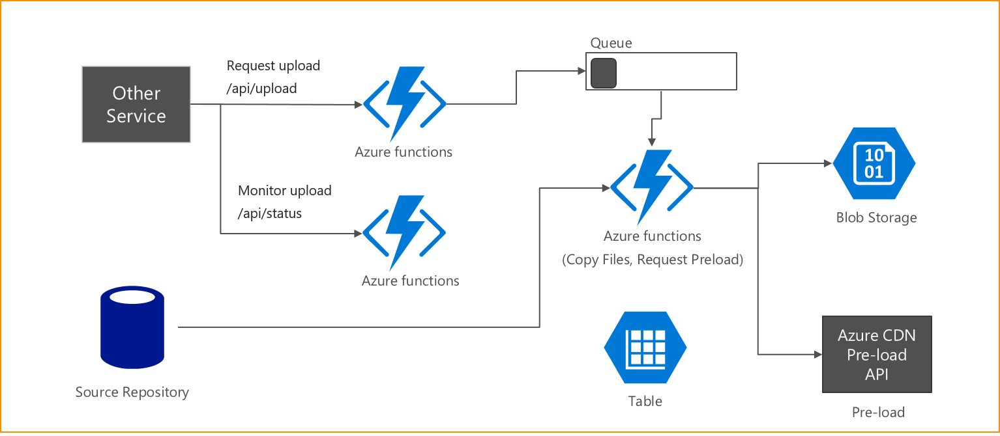

# HLS 스트리밍 컨텐츠를 Azure Blob에 업로드하고 CDN Pre-load 요청

본 애플리케이션은 Azure Functions를 사용하여 HLS 포멧으로 만들어진 동영상 스트리밍 컨텐츠를 Azure Blob 스토리지로 복사하고 컨텐츠의 시작 부분을 CDN에 Pre-load 요청을 한다.

## 개발환경 

[Visual Studio 2017 Preview](https://www.visualstudio.com/vs/preview/) (2017-06-13)와 [Azure Funtions Tools for Visual Studio 2017](https://marketplace.visualstudio.com/items?itemName=AndrewBHall-MSFT.AzureFunctionToolsforVisualStudio2017) 을 설치해야 한다. 

## 다이어그램



## 작동 순서

1. /api/upload API로 HLS URL 전송 (RequestUploadFunction)
1. HLS URL을 분석하여 복사가 필요한 파일들을 인식하고 10개 단위로 나눠서 Queue에 전송 (M3u8UrlParseFunction)
1. Queue에서 작업을 꺼내서 요청된 10개의 파일에 대해서 다운로드와 업로드를 실행 (ContentUploaderFunction)
1. /api/monitor, /api/status를 사용하여 모니터링 (MonitorUploadFunction, UploadStatusFunction)

## API Spec

실제 업로드는 서버에서 실행된다. 업로드 중에 오류가 발생하면 monitor, status API로 확인이 되지만 상세오류를 확인하는 api가 아직 없다. 여러개의 요청을 거의 동시에 실행하면 병렬로 업로드가 진행된다.

### 업로드 요청

- Request URL: http://{app-service-name}.azurewebsites.net/api/upload?code={secretcode}}
- Method: POST
- Header
    - Content-Type: application/json
- Body: Json 포멧으로 가장 많은 플레이리스트를 가지고 있는 m3u8 파일을 primaryUrl로 설정하고 나머지 플레이리스트를 배열로 secondaryUrls 로 만들어서 요청
- Request
```json
{
   "primaryUrl": "https://{hostname}/playlist_1080.m3u8",
    "secondaryUrls" : [
        "https://{hostname}/playlist_720.m3u8",
        "https://{hostname}/playlist_480.m3u8",
        "https://{hostname}/playlist_360.m3u8",
        "https://{hostname}/playlist_300.m3u8"
    ]
}
```

- Response 성공 (200)
```json
{
   "status": "success",
   "data": "",
   "message": "requested: http://{hostname}/playlist_1080.m3u8"
}
```

- Response 실패 (500)
```json
{
   "status": "error",
   "data": "{request body}",
   "message": "{오류 메시지 요약}"
}
```

### Status 확인

- Request URL: http://{app-service-name}.azurewebsites.net/api/status?code={secret-code}
- Method: POST
- Body: string 으로 상태 확인하려는 컨텐츠의 primaryUrl. json이 아니고 string
- Response 성공(200)
```json
{
   "url": " http://{hostname}/playlist_1080.m3u8",
   "fileCount": 3271,
   "completeCount": 866,
   "progress": 0.2647508407214918985019871599,
   "hasError": false
}
```
<table>
<tr>
<td>fileCount</td>
<td>전체 업로드 대상 파일 개수</td>
</tr>
<tr>
<td>completeCount</td>
<td>업로드 완료 개수</td>
</tr>
<tr>
<td>progress</td>
<td>(fileCount / complete) 진행률</td>
</tr>
</table>

### 모니터링

- Request URL: http://{app-service-name}.azurewebsites.net/api/monitor?code=5Rwx1DMz9KJX2dz8K9P/OAzuL/srvYumAgSmd3BKUpXWY/FyPYBTlg==
- Method: GET
- Response 성공(200)
```json
{
  "totalCount": 9,
  "errorCount": 1,
  "ongoingCount": 3,
  "ongoingList": [
    {
      "url": "http://odkcdn1.azureedge.net/72sec/playlist_1080.m3u8",
      "fileCount": 3457,
      "completeCount": 902,
      "progress": 0.2609198727220133063349725195,
      "hasError": false
    },
    {
      "url": "http://odkcdn1.azureedge.net/infinite-challenge/infinite-challenge-e528/playlist_720.m3u8",
      "fileCount": 3271,
      "completeCount": 891,
      "progress": 0.2723937633751146438398043412,
      "hasError": false
    },
    {
      "url": "http://odkcdn1.azureedge.net/youns-kitchen/youns-kitchen-e7/playlist_720.m3u8",
      "fileCount": 3589,
      "completeCount": 1521,
      "progress": 0.4237949289495681248258567846,
      "hasError": true
    }
  ],
  "errorList": [
      {
      "url": "http://odkcdn1.azureedge.net/youns-kitchen/youns-kitchen-e7/playlist_720.m3u8",
      "fileCount": 3589,
      "completeCount": 1521,
      "progress": 0.4237949289495681248258567846,
      "hasError": true
    }
  ]
}
```
<table>
<tr>
    <td>totalCount</td>
    <td>업로드 된 전체 컨텐츠 개수</td>
</tr>
<tr>
    <td>errorCount</td>
    <td>오류가 발생한 전체 컨텐츠 개수</td>
</tr>
<tr>
    <td>ongoingCount</td>
    <td>진행중인 컨텐츠 개수</td>
</tr>
<tr>
    <td>ongoingList</td>
    <td>진행중인 컨텐츠들의 상세 내용</td>
</tr>
<tr>
    <td>errorList</td>
    <td>오류가 발생한 컨텐츠들의 상세 내용</td>
</tr>
</table>
- Response 실패 (500)

## CDN Pre-load

Blob 스토리지는 CDN의 Origin이 되도록 설정을 해서 CDN 서비스를 이용해 빠른 스트리밍 컨텐츠 전송을 할 수 있다. 하지만 Blob에 올라간다고 즉시 CDN 엣지 서버에 캐싱이 되지는 않는다. 한번이라도 요청이 있어야 캐싱이 되고 그 이후로는 빠르게 서비스가 되기 때문이다. 하지만 Azure CDN의 Pre-load 를 이용하면 전세계 CDN 엣지에 캐시를 만들어 즉시 빠른 서비스를 할 수 있다.

Azure CDN의 Pre-load 기능은 제약사항이 있다. 1분에 10개의 URL만 요청이 가능하다. 따라서 전체 HLS 스트리밍 컨텐츠를 모두 Pre-load 할 수는 없고 컨텐츠의 처음 100초 정도를 요청한다. Pre-load 요청은 완료 될 때까지 약 2-3분이 걸린다.

Pre-load 요청은 Auzre REST API로 하기 때문에 c# 코드에서 Azure에 로그인을 해야한다. Azure AD를 사용해서 자격증명을 만들어야 한다. 이 내용은 ["포털을 사용하여 리소스에 액세스할 수 있는 Azure Active Directory 응용 프로그램 및 서비스 주체 만들기"](https://docs.microsoft.com/ko-kr/azure/azure-resource-manager/resource-group-create-service-principal-portal)참조해서 만들고 코드 작성의 상세내용은 
["Azure CDN 개발 시작"](https://docs.microsoft.com/ko-kr/azure/cdn/cdn-app-dev-net)을 참조한다. 